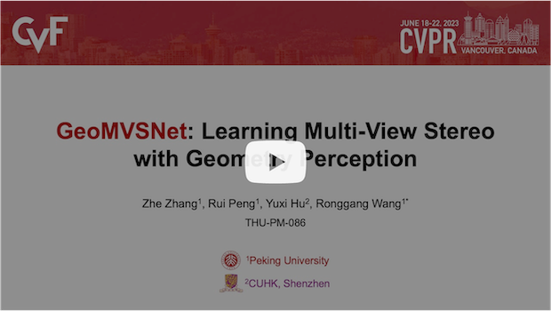
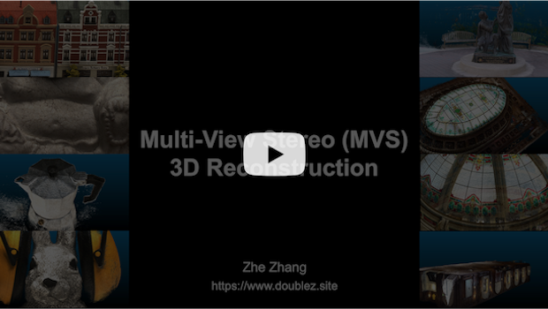

<h1 align="center">GeoMVSNet: Learning Multi-View Stereo With Geometry Perception (CVPR 2023)</h1>

<div align="center">
    <a href="https://www.doublez.site" target='_blank'>Zhe Zhang</a>, 
    <a href="https://github.com/prstrive" target='_blank'>Rui Peng</a>, 
    <a href="https://yuhsihu.github.io" target='_blank'>Yuxi Hu</a>, 
    <a href="https://www.ece.pku.edu.cn/info/1046/2147.htm" target='_blank'>Ronggang Wang</a>*
</div>

<br />

<div align="center">
    <a href="https://openaccess.thecvf.com//content/CVPR2023/html/Zhang_GeoMVSNet_Learning_Multi-View_Stereo_With_Geometry_Perception_CVPR_2023_paper.html" target='_blank'></a>&nbsp;
    <a href="https://openaccess.thecvf.com//content/CVPR2023/papers/Zhang_GeoMVSNet_Learning_Multi-View_Stereo_With_Geometry_Perception_CVPR_2023_paper.pdf" target='_blank'></a>&nbsp;
    <a href="https://openaccess.thecvf.com/content/CVPR2023/supplemental/Zhang_GeoMVSNet_Learning_Multi-View_CVPR_2023_supplemental.pdf" target='_blank'></a>&nbsp;
    <a href="https://paperswithcode.com/sota/point-clouds-on-tanks-and-temples?p=geomvsnet-learning-multi-view-stereo-with" target='_blank'></a>
</div>

<br />

<div align="center">

<a href="https://youtu.be/XqLDgJAZAKc" target='_blank'></a><a href="https://youtu.be/dLyuFMz1tAk" target='_blank'></a>

</div>


## 🔨 Setup

### 1.1 Requirements

Use the following commands to build the `conda` environment.

```bash
conda create -n geomvsnet python=3.8
conda activate geomvsnet
pip install -r requirements.txt
```

### 1.2 Datasets

Download the following datasets and modify the corresponding local path in `scripts/data_path.sh`.

#### DTU Dataset

**Training data**. We use the same DTU training data as mentioned in MVSNet and CasMVSNet, please refer to [DTU training data](https://drive.google.com/file/d/1eDjh-_bxKKnEuz5h-HXS7EDJn59clx6V/view) and [Depth raw](https://virutalbuy-public.oss-cn-hangzhou.aliyuncs.com/share/cascade-stereo/CasMVSNet/dtu_data/dtu_train_hr/Depths_raw.zip) for data download. Optional, you should download the [Recitfied raw](http://roboimagedata2.compute.dtu.dk/data/MVS/Rectified.zip) if you want to train the model in raw image resolution. Unzip and organize them as:

```
dtu/
├── Cameras
├── Depths
├── Depths_raw
├── Rectified
└── Rectified_raw (optional)
```

**Testing data**. For convenience, we use the [DTU testing data](https://drive.google.com/file/d/1rX0EXlUL4prRxrRu2DgLJv2j7-tpUD4D/view?usp=sharing) processed by CVP-MVSNet. Also unzip and organize it as:

```
dtu-test/
├── Cameras
├── Depths
└── Rectified
```

> Please note that the images and lighting here are consistent with the original dataset. 

#### BlendedMVS Dataset

Download the low image resolution version of [BlendedMVS dataset](https://drive.google.com/file/d/1ilxls-VJNvJnB7IaFj7P0ehMPr7ikRCb/view) and unzip it as:

```
blendedmvs/
└── dataset_low_res
    ├── ...
    └── 5c34529873a8df509ae57b58
```

#### Tanks and Temples Dataset

Download the intermediate and advanced subsets of [Tanks and Temples dataset](https://drive.google.com/file/d/1YArOJaX9WVLJh4757uE8AEREYkgszrCo/view) and unzip them. If you want to use the short range version of camera parameters for `Intermediate` subset, unzip `short_range_caemeras_for_mvsnet.zip` and move `cam_[]` to the corresponding scenarios.

```
tnt/
├── advanced
│   ├── ...
│   └── Temple
│       ├── cams
│       ├── images
│       ├── pair.txt
│       └── Temple.log
└── intermediate
    ├── ...
    └── Train
        ├── cams
        ├── cams_train
        ├── images
        ├── pair.txt
        └── Train.log
```


## 🚂 Training

You can train GeoMVSNet from scratch on DTU dataset and BlendedMVS dataset. After suitable setting and training, you can get the training checkpoints model in `checkpoints/[Dataset]/[THISNAME]`, and the following outputs lied in the folder:
- `events.out.tfevents*`: you can use `tensorboard` to monitor the training process.
- `model_[epoch].ckpt`: we save a checkpoint every `--save_freq`.
- `train-[TIME].log`: logged the detailed training message, you can refer to appropiate indicators to judge the quality of training.

### 2.1 DTU

To train GeoMVSNet on DTU dataset, you can refer to `scripts/dtu/train_dtu.sh`, specify `THISNAME`, `CUDA_VISIBLE_DEVICES`, `batch_size`, etc. to meet your demand. And run:

```bash
bash scripts/dtu/train_dtu.sh
```

The default training strategy we provide is the *distributed* training mode. If you want to use the *general* training mode, you can refer to the following code. 

<details>
<summary>general training script</summary>

```bash
CUDA_VISIBLE_DEVICES=0,1,2,3 python3 train.py ${@} \
    --which_dataset="dtu" --epochs=16 --logdir=$LOG_DIR \
    --trainpath=$DTU_TRAIN_ROOT --testpath=$DTU_TRAIN_ROOT \
    --trainlist="datasets/lists/dtu/train.txt" --testlist="datasets/lists/dtu/test.txt" \
    \
    --data_scale="mid" --n_views="5" --batch_size=16 --lr=0.025 --robust_train \
    --lrepochs="1,3,5,7,9,11,13,15:1.5"
```

</details>

> It should be noted that two different training strategies need to adjust the `batch_size` and `lr` parameters to achieve the best training results.


### 2.2 BlendedMVS

To train GeoMVSNet on BlendedMVS dataset, you can refer to `scripts/bled/train_blend.sh`, and also specify `THISNAME`, `CUDA_VISIBLE_DEVICES`, `batch_size`, etc. to meet your demand. And run:

```bash
bash scripts/blend/train_blend.sh
```

By default, we use `7` viewpoints as input for the BlendedMVS training. Similarly, you can choose to use the *distributed* training mode or the *general* one as mentioned in 2.1.

## ⚗️ Testing

### 3.1 DTU

For DTU testing, we use model trained on DTU training dataset. You can basically download our [DTU pretrained model](https://drive.google.com/file/d/147_UbjE87E-HB9sZ5yLDbckynH825nJd/view?usp=sharing) and put it into `checkpoints/dtu/geomvsnet/`. And perform *depth map estimation, point cloud fusion, and result evaluation* according to the following steps.
1. Run `bash scripts/dtu/test_dtu.sh` for depth map estimation. The results will be stored in `outputs/dtu/[THISNAME]/`, each scan folder holding `depth_est` and `confidence`, etc.
    - Use `outputs/visual.ipynb` for depth map visualization.
2. Run `bash scripts/dtu/fusion_dtu.sh` for point cloud fusion. We provide 3 different fusion methods, and we recommend the `open3d` option by default. After fusion, you can get `[FUSION_METHOD]_fusion_plys` under the experiment output folder, point clouds of each testing scan are there.

    <details>
    <summary>(Optional) If you want to use the "Gipuma" fusion method.</summary>

    1. Clone the [edited fusibile repo](https://github.com/YoYo000/fusibile).
    2. Refer to [fusibile configuration blog (Chinese)](https://zhuanlan.zhihu.com/p/460212787) for building details.
    3. Create a new python2.7 conda env.
        ```bash
        conda create -n fusibile python=2.7
        conda install scipy matplotlib
        conda install tensorflow==1.14.0
        conda install -c https://conda.anaconda.org/menpo opencv
        ```
    4. Use the `fusibile` conda environment for `gipuma` fusion method.

    </details>

3. Download the [ObsMask](http://roboimagedata2.compute.dtu.dk/data/MVS/SampleSet.zip) and [Points](http://roboimagedata2.compute.dtu.dk/data/MVS/Points.zip) of DTU GT point clouds from the official website and organize them as:

    ```
    dtu-evaluation/
    ├── ObsMask
    └── Points
    ```

4. Setup `Matlab` in command line mode, and run `bash scripts/dtu/matlab_quan_dtu.sh`. You can adjust the `num_at_once` config according to your machine's CPU and memory ceiling. After quantitative evaluation, you will get `[FUSION_METHOD]_quantitative/` and `[THISNAME].log` just store the quantitative results.

### 3.2 Tanks and Temples

For testing on [Tanks and Temples benchmark](https://www.tanksandtemples.org/leaderboard/), you can use any of the following configurations:
- Only train on DTU training dataset.
- Only train on BlendedMVS dataset.
- Pretrained on DTU training dataset and finetune on BlendedMVS dataset. (Recommend)

After your personal training, also follow these steps:
1. Run `bash scripts/tnt/test_tnt.sh` for depth map estimation. The results will be stored in `outputs/[TRAINING_DATASET]/[THISNAME]/`.
    - Use `outputs/visual.ipynb` for depth map visualization.
2. Run `bash scripts/tnt/fusion_tnt.sh` for point cloud fusion. We provide the popular dynamic fusion strategy, and you can tune the fusion threshold in `fusions/tnt/dypcd.py`.
3. Follow the *Upload Instructions* on the [T&T official website](https://www.tanksandtemples.org/submit/) to make online submissions.

### 3.3 Custom Data (TODO)

GeoMVSNet can reconstruct on custom data. At present, you can refer to [MVSNet](https://github.com/YoYo000/MVSNet#file-formats) to organize your data, and refer to the same steps as above for *depth estimation* and *point cloud fusion*.

## 💡 Results

Our results on DTU and Tanks and Temples Dataset are listed in the tables.

| DTU Dataset | Acc. ↓ | Comp. ↓ | Overall ↓ |
| ----------- | ------ | ------- | --------- |
| GeoMVSNet   | 0.3309 | 0.2593  | 0.2951    |

| T&T (Intermediate) | Mean ↑ | Family | Francis | Horse | Lighthouse | M60   | Panther | Playground | Train |
| ------------------ | ------ | ------ | ------- | ----- | ---------- | ----- | ------- | ---------- | ----- |
| GeoMVSNet          | 65.89  | 81.64  | 67.53   | 55.78 | 68.02      | 65.49 | 67.19   | 63.27      | 58.22 |

| T&T (Advanced) | Mean ↑ | Auditorium | Ballroom | Courtroom | Museum | Palace | Temple |
| -------------- | ------ | ---------- | -------- | --------- | ------ | ------ | ------ |
| GeoMVSNet      | 41.52  | 30.23      | 46.53    | 39.98     | 53.05  | 35.98  | 43.34  |

And you can download our [Point Cloud](https://disk.pku.edu.cn:443/link/69D473126C509C8DCBCC7E233FAAEEAA) and [Estimated Depth](https://disk.pku.edu.cn:443/link/4217EB2F063D2B10EDC711F54A12B5F7) for academic usage.

<details>
<summary>🌟 About Reproduce Paper Results</summary>


In our experiment, we found that the reproduction of MVS network is relatively difficult. Therefore, we summarize some of the problems encountered in our experiment as follows, hoping to be helpful to you.

**Q1. GPU Architecture Matters.**

There are two commonly used NVIDIA GPU series: GeForce RTX (e.g. 4090Ti, 3090Ti, 2090Ti) and Tesla (e.g. V100, T4). We find that there is generally no performance degradation in training and testing on the same series of GPUs. But on the contrary, for example, if you train on V100 and test on 3090Ti, the visual effect of the depth map looks exactly the same, but each pixel value is not exactly the same. We conjecture that the two series or architectures differ in numerical computation and processing precision.

> Our pretrained model is trained on NVIDIA V100 GPUs.

**Q2. Pytorch Version Matters.**

Different Cuda versions will result in different optional Pytorch versions. Different torch versions will affect the accuracy of network training and testing. One of the reasons we found is that the implementation and parameter control of the `F.grid_sample()` are various in different versions of Pytorch.

**Q3. Training Hyperparameters Matters.**

In the era of neural network, hyperparameters really matter. We made some network hyperparameters tuning, but it may not be the same as your configuration. Most fundamentally, due to differences in GPU graphics memory, you need to synchronize `batch_size` and `lr`. And the schedule of learning rate also matters.

**Q4. Testing Epoch Matters.**

By default, our model will train 16 epochs. But how to select the best training model for testing to achieve the best performance? One solution is to use [PyTorch-lightning](https://lightning.ai/docs/pytorch/latest/starter/introduction.html). For simplicity, you can decide which checkpoint to use based on the `.log` file we provide.

**Q5. Fusion Hyperparameters Matters.**

For both DTU and T&T datasets, the hyperparameters of point cloud fusion greatly affect the final performance. We have provided different fusion strategies and easy access to adjust parameters. Maybe you need to know the temperament of your model.

Qx. Others, you can [raise an issue](https://github.com/doubleZ0108/GeoMVSNet/issues/new/choose) if you meet other problems.

</details>

<br />

## ⚖️ Citation
```
@InProceedings{zhe2023geomvsnet,
  title={GeoMVSNet: Learning Multi-View Stereo With Geometry Perception},
  author={Zhang, Zhe and Peng, Rui and Hu, Yuxi and Wang, Ronggang},
  booktitle={Proceedings of the IEEE/CVF Conference on Computer Vision and Pattern Recognition},
  pages={21508--21518},
  year={2023}
}
```

## 💌 Acknowledgements

This repository is partly based on [MVSNet](https://github.com/YoYo000/MVSNet), [MVSNet-pytorch](https://github.com/xy-guo/MVSNet_pytorch), [CVP-MVSNet](https://github.com/JiayuYANG/CVP-MVSNet), [cascade-stereo](https://github.com/alibaba/cascade-stereo), [MVSTER](https://github.com/JeffWang987/MVSTER).

We appreciate their contributions to the MVS community.